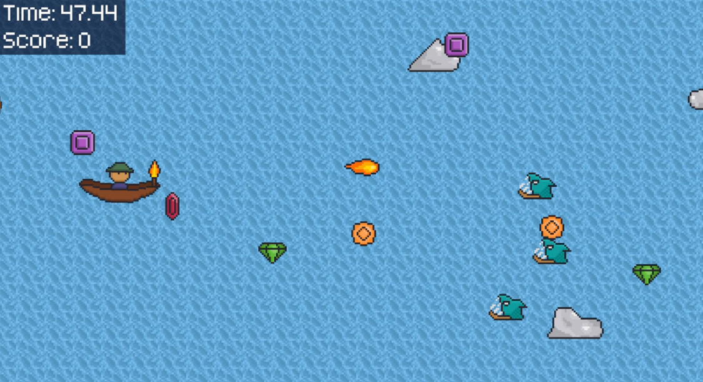

# River of Gemstones

A game where you play as a prospector in a river looking for gemstones while avoiding piranhas.

Made in only 3 days for [ScoreSpace Jam 26](https://itch.io/jam/scorejam26).

You can download and play this game [here](https://rogueduckster.itch.io/river-of-gemstones)

This game was created using [Python](https://www.python.org/) and the [Arcade library](https://github.com/pythonarcade/arcade)

